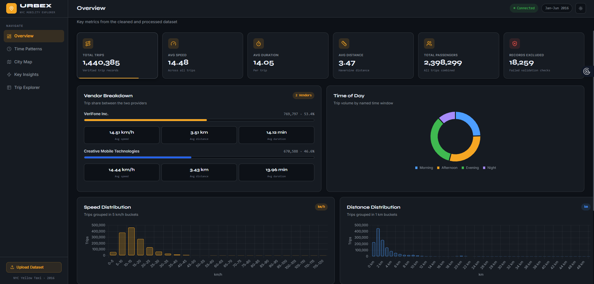
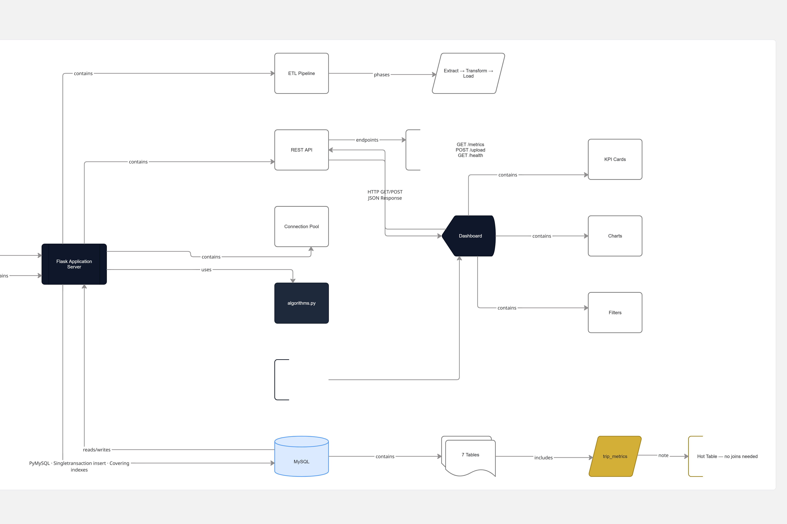
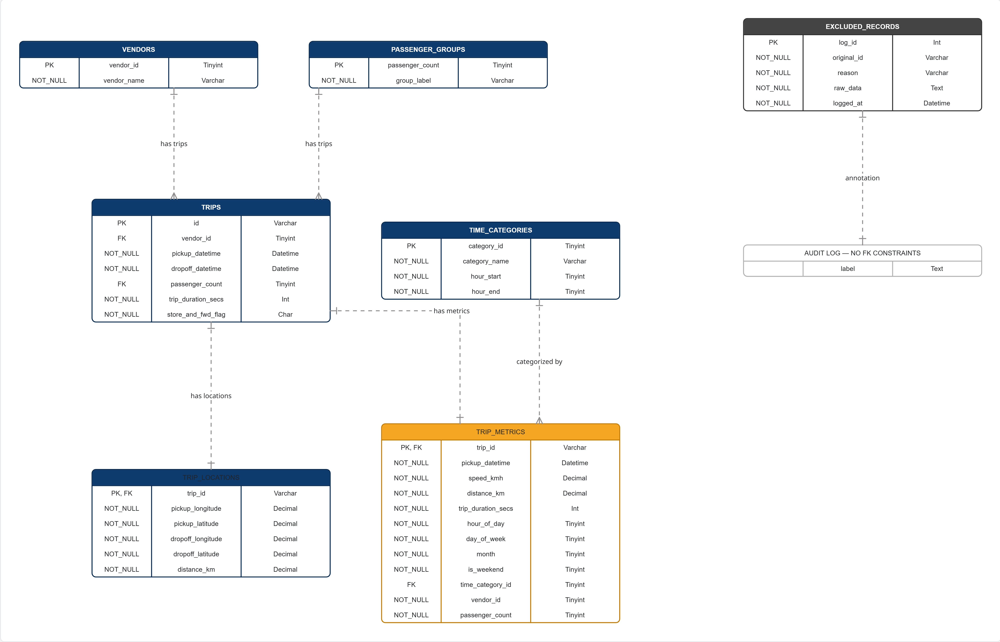

<div align="center">

<br/>

# URBEX

### Urban Mobility Explorer NYC Taxi Trip Dashboard

<br/>


<br/>

> A full-stack data engineering platform that processes **1.46 million** raw NYC taxi records through a custom ETL pipeline and renders an interactive analytics dashboard. Every algorithm merge sort, Haversine distance, IQR outlier detection, z-score anomaly detection was implemented from scratch without any library shortcuts.

<br/>

</div>


## Application

<!-- Replace with a screenshot of your running dashboard -->




## Architecture

<!-- Replace with your architecture diagram exported from Miro -->




## Database Schema

<!-- Replace with your ERD exported from Miro -->




## Project Structure

```
urbex/
├── backend/
│   ├── app.py               # Flask REST API connection pool, MD5 cache, late-materialization paging
│   ├── process_data.py      # ETL pipeline: Read ALL → Merge Sort → Insert ALL
│   ├── algorithms.py        # Merge sort · Haversine · IQR · z-score · grid snapping · top-K
│   ├── database.py          # MySQL connection factory + schema bootstrap
│   ├── config.py            # Database credentials edit before running
│   └── requirements.txt
├── frontend/
│   ├── index.html           # Single-page dashboard shell
│   ├── css/style.css        # Full light / dark theme via CSS variables
│   └── js/
│       ├── main.js          # API wiring, filters, trip explorer table
│       └── charts.js        # Chart.js builders for all visualisations
├── docs/
│   ├── ERD-URBEX.jpg        # Single-page dashboard shell
│   └── App-Architecture.jpg # Full-App Architecture
│              
├── erd_dbdiagram.dbml       # ERD source paste into dbdiagram.io
└── train.csv                # Raw dataset (place here before running the pipeline)
```


## Prerequisites

| Tool | Minimum Version |
|---|---|
|  Python | 3.9 |
|  MySQL | 8.0 |
| pip | latest |
| Any modern browser | Chrome / Firefox / Edge |


## Setup

### 1 Create the database

```sql
CREATE DATABASE urban_mobility
  CHARACTER SET utf8mb4
  COLLATE utf8mb4_unicode_ci;
```

### 2 Configure credentials
 
Open `backend/config.py`. We use **environment variables** so that real credentials are never hardcoded in the source file.
 
```python
DB_CONFIG = {
    "host":     os.environ.get("MYSQL_HOST",     "localhost"),
    "port":     int(os.environ.get("MYSQL_PORT", 3306)),
    "user":     os.environ.get("MYSQL_USER",     "root"),
    "password": os.environ.get("MYSQL_PASSWORD", ""),   # ← set this
    "database": os.environ.get("MYSQL_DATABASE", "urban_mobility"),
    "charset":  "utf8mb4",
}
```
 
**Running locally**  set the `MYSQL_PASSWORD` environment variable in your terminal before starting anything:
 
```bash
# macOS / Linux
export MYSQL_PASSWORD="your_mysql_password"
 
# Windows (Command Prompt)
set MYSQL_PASSWORD=your_mysql_password
 
# Windows (PowerShell)
$env:MYSQL_PASSWORD="your_mysql_password"
```
 
Alternatively, replace the empty string default directly in `config.py` for local development, just make sure you do not share it anywhere else.


### 3 Install dependencies

```bash
cd backend
pip install -r requirements.txt
```

### 4 Place the dataset

Download `train.csv` from [Kaggle](https://www.kaggle.com/competitions/nyc-taxi-trip-duration/data) and place it in the project root:

```
urbex/
└── train.csv
```

### 5 Run the ETL pipeline

```bash
python process_data.py
```

| Phase | What happens |
|---|---|
| Phase 1 | Reads every row. Validates coordinates (NYC bounding box), duration (60 s – 5 hrs), speed, and passenger count. Computes Haversine distance and derived time features. |
| Phase 2 | Sorts all accepted rows by pickup timestamp using the custom Merge Sort. |
| Phase 3 | Bulk-inserts all rows in one atomic transaction. Indexes are disabled during insert and rebuilt in batch for speed. |

For a quick demo on fewer rows:

```bash
python process_data.py --sample 50000
```

### 6 Start the server

```bash
python app.py
```

Open `http://localhost:5000`


## Loading Data Through the UI

If you prefer not to use the terminal, after starting the server:

1. Click **Load Dataset** in the sidebar
2. Upload `train.csv`
3. Enter an optional row limit for a fast preview
4. Click **Run Pipeline** live progress appears in the modal


## API Reference

Base URL: `http://localhost:5000` all endpoints return JSON.

| Method | Endpoint | Description |
|---|---|---|
| GET | `/api/health` | Server status + trip count |
| GET | `/api/overview` | KPI totals trips, passengers, avg speed, duration, distance |
| GET | `/api/hourly` | Trip volume and avg speed by hour of day |
| GET | `/api/weekday` | Trip volume and speed by day of week |
| GET | `/api/monthly` | Month-by-month breakdown |
| GET | `/api/vendors` | Per-vendor comparison (Creative Mobile vs VeriFone) |
| GET | `/api/passengers` | Passenger count distribution |
| GET | `/api/speed-dist` | Speed histogram in 5 km/h buckets |
| GET | `/api/distance-dist` | Distance histogram in 1 km buckets |
| GET | `/api/time-category` | Morning / afternoon / evening / night split |
| GET | `/api/weekend-weekday` | Weekend vs weekday stats |
| GET | `/api/rush-hour-insight` | Rush-hour speed vs off-peak speed |
| GET | `/api/excluded-stats` | Rejected records grouped by reason |
| GET | `/api/top-zones` | 50 busiest pickup grid cells |
| GET | `/api/map-points` | 5,000 sampled pickup coordinates |
| GET | `/api/trips` | Paginated and filtered trip explorer |
| POST | `/api/upload` | Upload a CSV and trigger the pipeline |
| GET | `/api/pipeline-status` | Live pipeline progress |
| GET | `/api/warmup` | Pre-warm all aggregation caches |

**Available filters on `/api/trips`:**

```
GET /api/trips?page=1&per_page=25&vendor_id=1&hour=8&is_weekend=0&min_speed=10&max_speed=60
```


## Algorithms

All implementations are in `backend/algorithms.py`. 

| Algorithm | Role in the system | Time | Space |
|---|---|---|---|
| Merge Sort | Sorts 1.46M records by timestamp before insertion | O(n log n) | O(n) |
| Haversine Distance | Computes pickup-to-dropoff distance for every record | O(1) | O(1) |
| IQR Outlier Detection | Derives outlier fences without assuming normality | O(n log n) | O(n) |
| Frequency Map | Counts occurrences without `Counter` | O(n) | O(m) |
| Top-K Selection | Returns k most frequent items using Merge Sort | O(m log m) | O(m) |
| Z-Score Anomaly | Flags values whose z-score exceeds a threshold | O(n) | O(n) |
| Grid Zone Snapping | Clusters GPS points into ~1 km cells for hotspot detection | O(1) per point | O(1) |


## Troubleshooting

**`cryptography package is required`**
MySQL 8 uses SHA-2 auth by default. Run `pip install cryptography`.

**`Cannot connect to MySQL`**
Confirm MySQL is running. Verify credentials in `config.py`. Confirm the `urban_mobility` database exists.

**Charts show "Upload a dataset to see this chart"**
The database is empty. Run `python process_data.py` or use the UI upload button.

**Pipeline crashes midway**
Re-running is safe the schema uses `INSERT IGNORE`. No data corruption will occur.

**Port 5000 already in use**
Edit the last line of `app.py`:
```python
app.run(host="0.0.0.0", port=5001, threaded=True)
```

---

**Team Members**

| Name | GitHub |
|------|--------|
| Chigozie Ndubuaku Emmanuel | [@Chigozie-Nuel](https://github.com/Chigozie-Nuel) |
| Gyann Caleb | [@AR-JUNA](https://github.com/AR-JUNA) |
| Moulaika Mugeni | [@mmugeni](https://github.com/mmugeni) |
| Lisette Mukiza | [@lisette-lachiever](https://github.com/lisette-lachiever) |

---

| | |
|---|---|
| Video Walkthrough | [ Video Walkthrough]() |
| Team Participation Sheet |[Team Participation Sheet](https://docs.google.com/spreadsheets/d/19MGYVmgUmIsozV-u2tsdzMtGmiu4Bv7VII-VFWYoOuE/edit?usp=sharing)|
